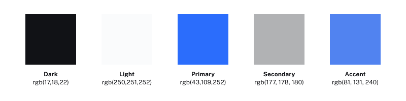
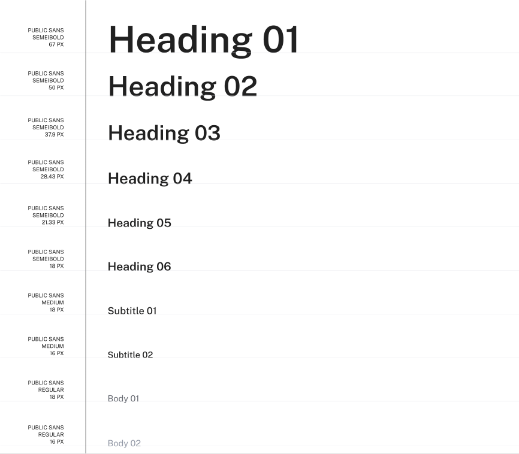

Note: This case study was created for a User Experience Design course in Humber College's Website Design & Development program. Evolve Camps is a company that allowed us to use their problems to demonstrating UX methodologies for camp transition challenges.

## Project Overview

Evolve Camps was a mobile application designed to ease the transition for children attending summer camp by empowering parents and camp counselors with engaging, tools to help them send their kids to camp. The app focuses on building camp-friendly habits, reducing pre-camp anxiety, and fostering excitement, while ensuring kids arrive prepared, confident, and ready for success.

By incorporating reward systems, interactive checklists, and progress tracking, Evolve Camps turns preparation into a fun, collaborative experience. Parents and counselors can work together to reinforce positive behaviors (like independence, teamwork, or packing skills), while kids feel motivated through achievements and visual progress.

<b>Key Goals:</b>

- Reduce stress for parents and kids during the pre-camp transition.

- Motivational design, that encourages skill-building (e.g., responsibility, adaptability) to increase engagement.

- Strengthen communication between parents, camp staff, and campers.

- Provide counselors with insights into each child’s readiness.

## Project Details

- Type of Work: Final Project for User-Experience Design
- Type Of Product: Mobile Application
- Github Code: None
- Figma Demonstration: None at the moment.
- Project Role: Application Interface Designer
- Team Size: 3
- Project Role: Application Interface Designer

## Objectives

1. Research competitors within the to assesses their competitors to identify their strengths, weaknesses, and strategies.

2. Provide educational resources and personalized challenges to empower users to make informed eco-conscious decisions.

3. Design a mobile app that organizes content in a way to motivate parents to adopt sustainable camping practices to help counsellors.

4. Create a basic theme for the application to ensure the design follows accessible guidelines on Android and IOS mobile platform.

5. Create an interactive prototype showcasing the application.

## Features

1. <b>Creating a research design document.</b>

2. <b>Organizing The Content For Camp:</b>

3. <b>Creating an outline for the Design System.</b>

4. <b>Showcasing The Application</b>

## Technology Stack

- Front-End: React Native using Expo GO.
- Back-End: Firebase for data synchronization and auth.
- Database: Firestore for scalable and flexible data storage.
- AI Integration: None AI was not available during this time.

## Creating a Style Guide

I was tasked with updating the visual identity of our application without creating a new design system. As our foundation for this design was using default guidelines for Android and IOS platforms.This prompted me to make a style guide focused on visual updates only ensure the application looked consistent across most devices.

### Color System Update

- Simplified the palette to 5 core colors + 3 neutrals
- Introduced accessible contrast adjustments,
- Enabled support for dark and light mode design.

Note: Colors are commonly defined in RGB format in mobile development because it aligns with how digital screens display color and is widely supported across platforms.

### Typography Refresh

- Recalibrated font sizes for better hierarchy.
- Changed default fonts to a custom one called Public Sans.
- Tuned spacing and letterforms for accessibility
- Unified label and body text usage

Public Sans was selected for its overall clarity and legibility, which includes distinguishable character shapes such as the lowercase 'i' and uppercase 'I'. These features contribute to improved readability, especially for users with visual or cognitive challenges.

### Component Styling

- Standardized corner radius across all interactive elements
- Reduced shadow use for flatter, modern feel
- Unified input field visuals to improve clarity

### Iconography

- Replaced filled icons with outlined versions for consistency
- Designed 5 new icons for core actions not covered by Material

### Layout & Spacing

- Rationalized vertical spacing to a base-12 scale
- Adjusted margins and paddings on all top-level views

## Outcome

EcoBuddy has successfully created a community of environmentally conscious individuals who actively participate in sustainable living practices. The app not only educates and motivates users but also provides tangible rewards for their commitment to a greener lifestyle, fostering a positive impact on the environment.

## Client Testimonial

> We couldn't be happier with the results delivered by Ethan Donovan. From the initial concept discussions to the final product, their responsiveness and collaborative approach were impressive. Our startup's website now stands out, thanks to their creative input and commitment to excellence.

**Note:** This case study is entirely fictional and created for the purpose of showcasing [Dante Astro.js theme functionality](https://justgoodui.com/astro-themes/dante/).
